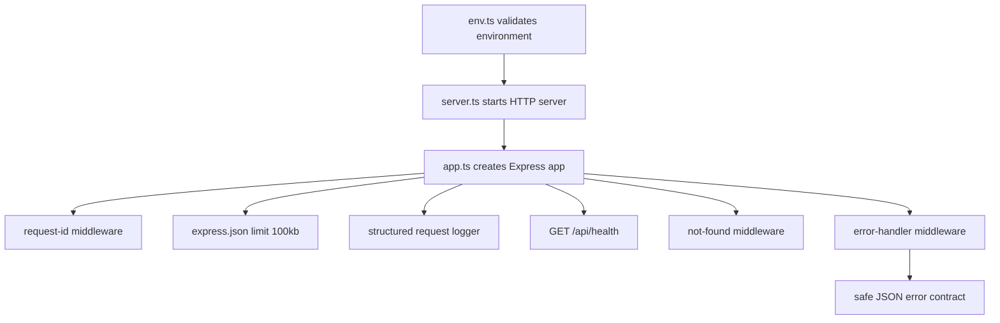

# WEB00 Backend B1 Implementation Plan

> **For agentic workers:** REQUIRED SUB-SKILL: Use `superpowers:subagent-driven-development` or `superpowers:executing-plans` to execute this plan task-by-task. Steps use checkbox syntax for future tracking.

**Goal:** prepare the future isolated WEB00 backend scaffold without touching the existing static frontend.

**Architecture:** B1 creates a standalone `/backend` Node.js service with Express application construction separated from HTTP server startup. The service validates runtime environment at startup, assigns a request ID to every request, logs structured JSON safely, returns a stable error contract, and exposes only `GET /api/health`.

**Tech Stack:** Node.js `22.23.1`, TypeScript `5.9.x`, Express `5.x`, ESM, Zod, Vitest, Supertest.

## Global Constraints

- Current repository root: `D:\WEB00_BACKEND`.
- Approved B0 specification: `docs/WEB00_BACKEND_B0_TECHNICAL_SPEC.md`.
- Future backend files may exist only under `backend/`.
- Root `package.json` must remain absent.
- Existing root HTML, CSS, JS, assets, GitHub Pages workflow, and frontend data files must not change in B1.
- B1 uses Node.js `22.23.1`, TypeScript `5.9.x`, Express `5.x`, ESM, and strict TypeScript.
- B1 does not include Prisma, PostgreSQL, Supabase, migrations, seed, authentication, JWT, roles, catalog CRUD, category CRUD, image upload, admin UI, frontend API adapter, Redis, Render deploy, GitHub Actions, or Docker.
- B1 future implementation uses TDD for behavior: write failing test, verify failure reason, add minimal implementation, verify the focused test passes.
- B1 future implementation does not commit after microtasks. One future commit is allowed only after full PASS and separate owner approval.
- This document is a plan only. It does not start implementation.

---

## 1. Goal

B1 prepares a minimal, testable backend foundation that can be extended in later phases without changing the current frontend. The future implementation must create an isolated `backend/` project with:

- Node.js runtime contract `>=22.23.1 <23`;
- TypeScript `5.9.x` and strict compiler settings;
- Express `5.x` application boundary;
- environment validation before server startup;
- request ID handling for every request;
- structured JSON logging with sensitive-data exclusions;
- unified error response contract;
- `GET /api/health`;
- unknown-route handler;
- global error handler;
- graceful shutdown for `SIGTERM` and `SIGINT`;
- automated tests for the B1 behavioral contract;
- no frontend, GitHub Pages, deploy, database, auth, upload, or admin changes.

## 2. Preconditions

Before a future B1 implementation task starts, the implementer must verify:

```powershell
Set-Location D:\WEB00_BACKEND
git branch --show-current
git status --short
git log -1 --format="%H %s"
Test-Path backend
Test-Path package.json
```

Expected conditions:

- work starts from a clean Git state approved by the owner;
- `backend` does not exist before the scaffold task begins;
- root `package.json` does not exist;
- B0 specification is available at `docs/WEB00_BACKEND_B0_TECHNICAL_SPEC.md`;
- review or merge of an already opened B0 PR is not a technical blocker for local B1 planning or local B1 implementation, but the future B1 commit must still be separately approved.

If the future worktree contains unrelated changes outside `backend/`, the implementer must stop before creating scaffold files.

Pre-implementation Git state for future B1 scaffold work:

- a separate preparatory task must create local branch `feat/web00-backend-b1` from the current HEAD;
- the preparatory task may add and locally commit only `docs/WEB00_BACKEND_B1_IMPLEMENTATION_PLAN.md`;
- the plan commit must happen only after separate owner approval;
- pushing the plan commit is not required for local B1 implementation;
- before creating `/backend`, the future implementation worktree must be clean;
- B1 implementation must not run on `docs/web00-backend-b0`;
- B1 implementation has no dependency on review, merge, or actions by Pavel or any other participant.

Approved preparatory sequence, only after a separate owner task allows it:

```powershell
Set-Location D:\WEB00_BACKEND
git branch --show-current
git status --short
git switch -c feat/web00-backend-b1
git add -- docs/WEB00_BACKEND_B1_IMPLEMENTATION_PLAN.md
git commit -m "docs: add WEB00 backend B1 implementation plan"
git status --short
```

Do not run this preparatory sequence during this planning task.

## 3. Scope

B1 future implementation creates only the backend scaffold and its tests:

- project metadata under `backend/`;
- TypeScript and Vitest configuration under `backend/`;
- `.env.example` with non-secret examples under `backend/`;
- Express app construction under `backend/src/app.ts`;
- HTTP server startup and shutdown under `backend/src/server.ts`;
- environment validation under `backend/src/config/env.ts`;
- request ID utilities under `backend/src/lib/request-id.ts`;
- error utilities under `backend/src/lib/errors.ts`;
- structured logger under `backend/src/lib/logger.ts`;
- not-found and error middleware under `backend/src/middleware/`;
- health route and response schema under `backend/src/modules/health/`;
- automated tests under `backend/tests/`.

B1 may run future npm commands only from `D:\WEB00_BACKEND\backend` after explicit implementation approval. The current planning task must not run npm install commands.

## 4. Explicit out-of-scope

B1 explicitly excludes:

- root `package.json`;
- root frontend build tooling;
- frontend HTML, CSS, JS, image, manifest, service worker, and localStorage adapter changes;
- `.github/workflows/pages.yml` or any GitHub Pages behavior;
- Render service creation, deployment, environment changes, or GitHub Pages changes;
- Prisma packages, Prisma config, Prisma schema, migrations, seed scripts, and database connection code;
- PostgreSQL or Supabase packages and credentials;
- authentication, JWT, refresh cookies, roles, users, sessions, and admin authorization;
- site CRUD, category CRUD, lead APIs, upload endpoints, image processing, and admin UI;
- Redis, rate-limit storage, Docker, GitHub Actions, background jobs, and scheduled cleanup workers;
- commits, pushes, pull requests, merge, deploy, or auto-merge during implementation unless a later owner task explicitly authorizes them.

The B0 document mentions future Prisma work, but the current B1 plan follows the newer B1 boundary from this task: no Prisma or database package is included in B1.

## 5. File map

Planned future file map:

```text
backend/
├── package.json
├── package-lock.json
├── tsconfig.json
├── tsconfig.build.json
├── tsconfig.typecheck.json
├── vitest.config.ts
├── .env.example
├── README.md
├── src/
│   ├── app.ts
│   ├── server.ts
│   ├── config/
│   │   └── env.ts
│   ├── lib/
│   │   ├── errors.ts
│   │   ├── logger.ts
│   │   └── request-id.ts
│   ├── middleware/
│   │   ├── not-found.ts
│   │   └── error-handler.ts
│   └── modules/
│       └── health/
│           ├── health.route.ts
│           └── health.schema.ts
└── tests/
    ├── setup.ts
    ├── health.test.ts
    ├── errors.test.ts
    ├── env.test.ts
    ├── request-id.test.ts
    ├── server.test.ts
    └── repository-boundary.test.ts
```

Technical adjustment from the requested starter structure:

- `backend/tests/request-id.test.ts` is added because request ID validation, preservation, replacement, and generation are independent B1 acceptance requirements.
- `backend/tests/server.test.ts` is added because graceful shutdown must have an automated strategy that does not terminate the Vitest process.
- `backend/tests/repository-boundary.test.ts` is added because "frontend files remain unchanged" is a required test case and should be checked by automation, not only by human review.

File responsibilities:

- `backend/package.json`: isolated backend package contract, scripts, Node engine, ESM type, dependencies.
- `backend/package-lock.json`: generated npm lockfile for reproducible future `npm ci`.
- `backend/tsconfig.json`: shared strict TypeScript base configuration.
- `backend/tsconfig.build.json`: production build configuration for `src/**/*.ts` only.
- `backend/tsconfig.typecheck.json`: no-emit typecheck configuration for `src/**/*.ts`, `tests/**/*.ts`, and `vitest.config.ts`.
- `backend/vitest.config.ts`: Vitest Node environment, setup file, test include rules.
- `backend/.env.example`: safe local examples for B1 environment variables only.
- `backend/README.md`: backend-only run, test, build, and scope notes.
- `backend/src/app.ts`: creates and returns the configured Express application from required `CreateAppOptions`; does not call `listen` and does not read `process.env`.
- `backend/src/server.ts`: calls `parseEnv(process.env)`, starts the HTTP server, registers shutdown handlers, and never registers test routes.
- `backend/src/config/env.ts`: validates environment input with Zod and exports typed `AppEnv` helpers.
- `backend/src/lib/errors.ts`: defines `AppError`, error codes, parser-error mapping, details shape, and safe response envelope builder.
- `backend/src/lib/logger.ts`: defines `AppLogger`, writes structured JSON logs with field allowlists, and supports memory sinks for tests.
- `backend/src/lib/request-id.ts`: validates incoming `X-Request-Id`, generates fallback IDs with `crypto.randomUUID`, and exposes middleware.
- `backend/src/middleware/not-found.ts`: converts unknown routes to `ROUTE_NOT_FOUND`.
- `backend/src/middleware/error-handler.ts`: implements the four-argument Express error handler and maps known, parser, and unknown errors to the B1 error contract.
- `backend/src/modules/health/health.schema.ts`: Zod schema for the health response.
- `backend/src/modules/health/health.route.ts`: Express router for `GET /api/health`, using `AppEnv` service name and injectable `now`.
- `backend/tests/setup.ts`: isolated test environment defaults, env restoration, and test cleanup.
- `backend/tests/health.test.ts`: Supertest coverage for health response and response headers.
- `backend/tests/errors.test.ts`: Supertest coverage for 404 and safe 500 error contracts.
- `backend/tests/env.test.ts`: environment validation success and failure cases.
- `backend/tests/request-id.test.ts`: unit coverage for request ID validation and generation.
- `backend/tests/server.test.ts`: graceful shutdown helper coverage without exiting the test runner.
- `backend/tests/repository-boundary.test.ts`: Git-based guard that resolves repo root and verifies no tracked or untracked non-backend files changed during B1.

## 6. Dependency contract

Future `backend/package.json` must include:

```json
{
  "private": true,
  "type": "module",
  "main": "dist/server.js",
  "engines": {
    "node": ">=22.23.1 <23"
  },
  "scripts": {
    "dev": "node --import tsx src/server.ts",
    "build": "tsc -p tsconfig.build.json",
    "start": "node dist/server.js",
    "typecheck": "tsc -p tsconfig.typecheck.json",
    "test": "vitest",
    "test:run": "vitest run",
    "check": "npm run typecheck && npm run test:run && npm run build"
  }
}
```

Production dependencies for B1:

```text
express@^5
zod@^4
```

Development dependencies for B1:

```text
@types/express@^5
@types/node@^22
@types/supertest@^6
supertest@^7
tsx@^4
typescript@~5.9.0
vitest@^3
```

Dependency exclusions:

- no Prisma packages;
- no PostgreSQL packages;
- no Supabase packages;
- no auth, JWT, cookie-session, password hashing, upload, image processing, Redis, Docker, or deploy packages;
- no root dependencies and no root package manager files.

Future dependency installation command, only inside an approved B1 implementation task:

```powershell
Set-Location D:\WEB00_BACKEND\backend
npm install express@^5 zod@^4
npm install --save-dev @types/express@^5 @types/node@^22 @types/supertest@^6 supertest@^7 tsx@^4 typescript@~5.9.0 vitest@^3
```

The future lockfile must be generated by npm and committed only after the full B1 checkpoint passes and the owner explicitly approves a commit.

## 7. Runtime and TypeScript contract

Runtime contract:

- Node.js range: `>=22.23.1 <23`;
- package module mode: `"type": "module"`;
- production entrypoint: `dist/server.js`;
- source files: `backend/src`;
- emitted files: `backend/dist`;
- tests: `backend/tests`;
- `app.ts` imports must not start a network listener.

Node ESM import contract:

- `backend/package.json` contains `"type": "module"`;
- TypeScript uses `"module": "NodeNext"` and `"moduleResolution": "NodeNext"`;
- all relative imports inside backend `.ts` files that resolve to project TypeScript modules must use the future emitted `.js` extension;
- package imports such as `express`, `zod`, `node:http`, and `node:crypto` do not use relative `.js` extensions.

Example:

```typescript
import { parseEnv } from "./config/env.js";
```

TypeScript config split:

`backend/tsconfig.json` is the shared strict base:

```json
{
  "compilerOptions": {
    "target": "ES2022",
    "lib": ["ES2022"],
    "module": "NodeNext",
    "moduleResolution": "NodeNext",
    "rootDir": "src",
    "outDir": "dist",
    "strict": true,
    "noUncheckedIndexedAccess": true,
    "exactOptionalPropertyTypes": true,
    "noImplicitOverride": true,
    "noFallthroughCasesInSwitch": true,
    "noImplicitReturns": true,
    "sourceMap": true,
    "resolveJsonModule": true,
    "esModuleInterop": true,
    "forceConsistentCasingInFileNames": true,
    "skipLibCheck": false
  }
}
```

`backend/tsconfig.build.json` is the production build config:

```json
{
  "extends": "./tsconfig.json",
  "compilerOptions": {
    "rootDir": "src",
    "outDir": "dist"
  },
  "include": ["src/**/*.ts"],
  "exclude": ["dist", "node_modules", "tests", "vitest.config.ts"]
}
```

`backend/tsconfig.typecheck.json` is the no-emit typecheck config:

```json
{
  "extends": "./tsconfig.json",
  "compilerOptions": {
    "noEmit": true
  },
  "include": ["src/**/*.ts", "tests/**/*.ts", "vitest.config.ts"],
  "exclude": ["dist", "node_modules"]
}
```

Typecheck contract:

- `npm run typecheck` runs `tsc -p tsconfig.typecheck.json`;
- `npm run build` runs `tsc -p tsconfig.build.json` and emits to `dist`;
- `npm run check` runs `npm run typecheck && npm run test:run && npm run build`;
- TypeScript `enum` must not be used unless a later task documents a concrete interoperability need. B1 should prefer literal unions and `as const` maps for error codes and environment values.

## 8. Application architecture

B1 architecture is intentionally small:



Boundaries:

- `backend/src/app.ts` exports `createApp(options: CreateAppOptions): Express`.
- `CreateAppOptions.env` is required, so `app.ts` never reads `process.env`.
- `backend/src/server.ts` imports `createApp`, calls `parseEnv(process.env)`, creates the HTTP server, calls `listen`, and registers shutdown handlers.
- Tests import `createApp` directly, pass an isolated `AppEnv`, and use Supertest without opening a port.
- The server layer must not introduce database cleanup, storage cleanup, background jobs, auth, or deployment logic in B1.
- Middleware order is part of the contract: request ID first, JSON body limit, request logging, health routes, test routes when explicitly provided, not-found, error handler.

`CreateAppOptions` interface:

```typescript
import type { Express } from "express";
import type { AppEnv } from "./config/env.js";
import type { AppLogger } from "./lib/logger.js";

interface CreateAppOptions {
  env: AppEnv;
  logger?: AppLogger;
  registerTestRoutes?: (app: Express) => void;
  now?: () => Date;
}
```

`CreateAppOptions` rules:

- `env` is mandatory and is the only environment source for `app.ts`;
- `app.ts` must not import or read `process.env`;
- `server.ts` is the only B1 production entrypoint that calls `parseEnv(process.env)`;
- tests pass isolated `AppEnv` objects into `createApp`;
- `logger` supports memory sinks in tests and defaults to a production-safe structured logger when omitted;
- `registerTestRoutes` exists only so tests can mount routes that throw errors or exercise parser behavior;
- production server calls `createApp({ env })` or `createApp({ env, logger })` and never provides `registerTestRoutes`;
- `now` provides deterministic `GET /api/health` timestamps in tests and defaults to `() => new Date()` in normal runtime.

Interfaces between ordered tasks:

- Task 2 produces `AppEnv` and `parseEnv(input: NodeJS.ProcessEnv): AppEnv`.
- Task 3 produces `AppError`, `ErrorCode`, and the safe error response builder consumed by Task 6.
- Task 4 produces request ID helpers and middleware consumed by Task 5 and Task 6.
- Task 5 consumes `AppEnv`, defines `CreateAppOptions`, and exposes `createApp(options: CreateAppOptions): Express`.
- Task 6 consumes `AppError`, request ID locals, and `CreateAppOptions.registerTestRoutes` for test-only error routes.
- Task 7 produces `AppLogger` and `createLogger`, then wires `CreateAppOptions.logger` into request logging.
- Task 8 consumes `parseEnv`, `AppEnv`, and `createApp({ env })`; it is the only production task that reads `process.env`.

## 9. Environment contract

B1 environment variables:

| Name | Required behavior | Safe example |
|---|---|---|
| `NODE_ENV` | one of `development`, `test`, `production`; defaults to `development` outside tests only if unset | `development` |
| `PORT` | integer from `1` to `65535`; defaults to `3000` for development and test; required in production | `3000` |
| `LOG_LEVEL` | one of `silent`, `error`, `warn`, `info`, `debug`; defaults to `info` outside tests and `silent` in tests | `info` |
| `SERVICE_NAME` | non-empty service slug; expected value `web00-backend` | `web00-backend` |

Validation rules:

- `backend/src/config/env.ts` must use Zod.
- Environment validation runs before `server.listen`.
- Validation failure throws a safe configuration error that lists only variable names and safe issue labels, not secret values.
- `.env.example` contains only the four B1 variable names and safe examples.
- Production relies on provider environment variables, not a committed or local `.env`.
- Tests call an exported `parseEnv(input: NodeJS.ProcessEnv)` helper so each test can pass isolated environment maps without mutating global state for unrelated tests.

`.env.example` future content:

```text
NODE_ENV=development
PORT=3000
LOG_LEVEL=info
SERVICE_NAME=web00-backend
```

## 10. Request lifecycle

For every HTTP request:

1. Request ID middleware reads `X-Request-Id`.
2. If the incoming value is valid, the server preserves it.
3. If the incoming value is absent or invalid, the server creates `req_${crypto.randomUUID()}`.
4. The server stores the final ID in `res.locals.requestId`.
5. The server returns the final ID in the `X-Request-Id` response header.
6. `express.json({ limit: "100kb" })` parses `application/json` bodies.
7. Malformed JSON is mapped to `400 INVALID_JSON`.
8. JSON bodies larger than `100kb` are mapped to `413 PAYLOAD_TOO_LARGE`.
9. Request logger records safe metadata after response completion.
10. Router handles `/api/health`.
11. Test-only routes are registered only when `registerTestRoutes` is provided by tests.
12. Unknown routes become `ROUTE_NOT_FOUND`.
13. Global error handler returns the B1 error contract.

Request ID validation:

- header name: `X-Request-Id`;
- accepted length: `1` to `80` characters;
- accepted characters: `A-Z`, `a-z`, `0-9`, `_`, `.`, `:`, `-`;
- invalid values are replaced, not echoed;
- generated value format: `req_${crypto.randomUUID()}`;
- no third-party ID dependency.

Body limit:

- JSON body limit starts at `100kb`;
- malformed `application/json` returns HTTP `400` with code `INVALID_JSON`;
- request body larger than `100kb` returns HTTP `413` with code `PAYLOAD_TOO_LARGE`;
- parser error responses use the approved JSON error envelope;
- parser error responses include `requestId`;
- parser error responses do not expose parser internals, raw body content, or stack traces;
- URL-encoded body parsing is outside B1;
- multipart upload is not included in B1.

## 11. Error contract

Every error response must use this shape:

```json
{
  "error": {
    "code": "MACHINE_READABLE_CODE",
    "message": "Safe user-facing message",
    "details": [],
    "requestId": "req_..."
  }
}
```

B1 error model:

- `AppError` stores `statusCode`, `code`, `message`, and safe `details`;
- `ErrorCode` is a literal union, not a TypeScript enum;
- public messages are safe for UI display;
- unknown errors become `500 INTERNAL_ERROR` with message `Internal server error`;
- unknown route errors become `404 ROUTE_NOT_FOUND` with message `Route not found`;
- malformed JSON errors become `400 INVALID_JSON` with message `Invalid JSON body`;
- JSON bodies larger than `100kb` become `413 PAYLOAD_TOO_LARGE` with message `Request body too large`;
- response `Content-Type` is `application/json`;
- `requestId` is always included;
- stack traces are never included in API responses, including non-production responses;
- raw unknown error messages are never exposed to clients;
- validation details may contain only safe field paths and safe messages.

Express error handler signature:

```typescript
import type { NextFunction, Request, Response } from "express";

function errorHandler(
  error: unknown,
  request: Request,
  response: Response,
  next: NextFunction
): void
```

Express error handler rules:

- all four arguments are mandatory so Express recognizes the function as error-handling middleware;
- middleware is installed last in `app.ts`;
- if `response.headersSent === true`, the handler must call `next(error)` exactly once and return without creating a new response;
- `AppError` instances are returned through the approved error contract;
- unknown errors become `500 INTERNAL_ERROR`;
- raw error messages and stack traces are not returned.

B1 error codes:

```text
ROUTE_NOT_FOUND
INTERNAL_ERROR
VALIDATION_ERROR
INVALID_JSON
PAYLOAD_TOO_LARGE
CONFIGURATION_ERROR
```

HTTP status mapping:

- `ROUTE_NOT_FOUND = 404`;
- `INTERNAL_ERROR = 500`;
- `VALIDATION_ERROR = 400`;
- `INVALID_JSON = 400`;
- `PAYLOAD_TOO_LARGE = 413`.

`CONFIGURATION_ERROR` is internal startup terminology and must not be exposed by an HTTP route in B1.

## 12. Logging contract

B1 logger writes one JSON object per request completion.

Required request log fields:

- `level`;
- `time`;
- `service`;
- `environment`;
- `requestId`;
- `method`;
- `path`;
- `statusCode`;
- `durationMs`.

Startup and shutdown logs:

- include `service`, `environment`, and event name;
- do not include raw environment values beyond `NODE_ENV`, `LOG_LEVEL`, and `SERVICE_NAME`;
- do not include secrets.

Forbidden log content:

- `Authorization`;
- `Cookie`;
- passwords;
- tokens;
- raw request body;
- full headers object;
- environment secrets;
- stack traces in request logs.

Test behavior:

- tests set `LOG_LEVEL=silent` by default in `backend/tests/setup.ts`;
- logging tests inject an `AppLogger` memory sink through `createApp({ env, logger })` to assert emitted JSON without writing to console;
- logger tests must include a request with `Authorization` and `Cookie` headers and assert those values do not appear in serialized log output.

## 13. Health endpoint

Endpoint:

```text
GET /api/health
```

Auth and data rules:

- auth: none;
- role: public;
- request body: none;
- database calls: none;
- external service calls: none;
- no environment or secret disclosure;
- response `Content-Type`: `application/json`.

Success response:

```json
{
  "data": {
    "status": "ok",
    "service": "web00-backend",
    "time": "2026-07-24T00:00:00.000Z"
  }
}
```

Schema:

- `data.status` is literal `ok`;
- `data.service` equals environment `SERVICE_NAME`, with B1 expected value `web00-backend`;
- `data.time` is a valid ISO-8601 timestamp from `options.now().toISOString()`;
- normal runtime defaults `now` to `() => new Date()`;
- tests pass a deterministic `now` function through `CreateAppOptions`.

Required tests:

- returns HTTP `200`;
- returns `application/json`;
- response body matches the schema;
- `time` equals the deterministic value supplied through `CreateAppOptions.now` in tests and still round-trips to ISO format;
- does not expose `NODE_ENV`, `PORT`, `LOG_LEVEL`, or any other environment object.

## 14. Graceful shutdown

Signals:

- `SIGTERM`;
- `SIGINT`.

Shutdown behavior:

- log a safe shutdown event;
- stop accepting new connections with `server.close`;
- allow in-flight requests to complete within a fixed timeout;
- force process exit after `10_000` ms if close callback does not complete;
- do not run database cleanup in B1;
- do not run storage cleanup in B1;
- do not create background or infinite cleanup loops.

Test strategy:

- `server.ts` must export a pure helper such as `createShutdownHandler(server, options)` so tests can invoke shutdown behavior without sending real OS signals or exiting Vitest;
- tests use a fake server object with a `close(callback)` method and fake timers;
- tests assert that close is called once and the forced timeout path is scheduled;
- tests do not call `process.exit` directly. The handler receives an injectable `exit` function for tests.

## 15. Test design

Required automated test cases:

| File | Test case | Expected result |
|---|---|---|
| `backend/tests/setup.ts` | test env restoration | changed env variables are restored after each test |
| `backend/tests/health.test.ts` | health returns 200 | `GET /api/health` returns status `200` |
| `backend/tests/health.test.ts` | health response schema | body matches `healthResponseSchema` |
| `backend/tests/health.test.ts` | health time is deterministic and valid ISO-8601 | injected `now` value is returned and `new Date(time).toISOString() === time` |
| `backend/tests/health.test.ts` | content type is JSON | `Content-Type` contains `application/json` |
| `backend/tests/request-id.test.ts` | request ID is generated | missing header returns generated `X-Request-Id` matching `req_` UUID format |
| `backend/tests/request-id.test.ts` | valid incoming request ID is preserved | valid header is echoed in response |
| `backend/tests/request-id.test.ts` | invalid incoming request ID is replaced | invalid header is not echoed and generated ID is returned |
| `backend/tests/errors.test.ts` | unknown route returns 404 error contract | response has `error.code=ROUTE_NOT_FOUND` and requestId |
| `backend/tests/errors.test.ts` | internal error returns safe 500 | response has `error.code=INTERNAL_ERROR` and safe message |
| `backend/tests/errors.test.ts` | stack trace is absent from response | serialized response does not contain `stack` or thrown message |
| `backend/tests/errors.test.ts` | headersSent delegates to Express | handler calls `next(error)` exactly once and creates no new response |
| `backend/tests/errors.test.ts` | malformed JSON returns 400 | response has `error.code=INVALID_JSON`, JSON content type, safe message, and requestId |
| `backend/tests/errors.test.ts` | payload over 100kb returns 413 | response has `error.code=PAYLOAD_TOO_LARGE`, JSON content type, safe message, and requestId |
| `backend/tests/env.test.ts` | invalid environment fails validation | parse helper returns or throws safe validation failure |
| `backend/tests/env.test.ts` | valid environment passes | typed env object has parsed `PORT` number and service name |
| `backend/tests/server.test.ts` | graceful shutdown closes server | injected server `close` is called |
| `backend/tests/server.test.ts` | shutdown timeout is scheduled | fake timer verifies forced timeout path without exiting Vitest |
| `backend/tests/repository-boundary.test.ts` | frontend files remain unchanged | `git -C <repoRoot>` reports no tracked or untracked changes outside `backend/` |

Vitest config contract for `backend/vitest.config.ts`:

```typescript
export default defineConfig({
  test: {
    environment: "node",
    setupFiles: ["tests/setup.ts"],
    isolate: true,
    include: ["tests/**/*.test.ts"],
    clearMocks: true,
    restoreMocks: true
  }
});
```

Test setup contract for `backend/tests/setup.ts`:

- preserve original values for mutable B1 env variables before each test;
- restore original values after each test;
- reset or restore mocks through Vitest config rather than relying on test order;
- leave no global state that changes the result of another test;
- tests must pass when run individually or as the full suite.

Focused test commands:

```powershell
Set-Location D:\WEB00_BACKEND\backend
npm run test:run -- tests/env.test.ts
npm run test:run -- tests/errors.test.ts
npm run test:run -- tests/request-id.test.ts
npm run test:run -- tests/health.test.ts
npm run test:run -- tests/server.test.ts
npm run test:run -- tests/repository-boundary.test.ts
```

## 16. Ordered implementation tasks

### Task 1: Project Boundary And Toolchain

- цель: create the isolated backend package, split TypeScript configs, Vitest config, safe env example, README, and initial repository-boundary test.
- точные файлы:
  - create `backend/package.json`;
  - create `backend/package-lock.json`;
  - create `backend/tsconfig.json`;
  - create `backend/tsconfig.build.json`;
  - create `backend/tsconfig.typecheck.json`;
  - create `backend/vitest.config.ts`;
  - create `backend/.env.example`;
  - create `backend/README.md`;
  - create `backend/tests/setup.ts`;
  - create `backend/tests/repository-boundary.test.ts`.
- зависимости от предыдущих задач: none.
- действия:
  - [ ] Verify from repo root that `backend` and root `package.json` are absent.
  - [ ] Create `backend/package.json` with the package contract from section 6.
  - [ ] From `D:\WEB00_BACKEND\backend`, run the future dependency install commands from section 6 to generate `package-lock.json`.
  - [ ] Create `backend/tsconfig.json` with the shared strict base from section 7.
  - [ ] Create `backend/tsconfig.build.json` with production build include `src/**/*.ts` only.
  - [ ] Create `backend/tsconfig.typecheck.json` with no-emit include `src/**/*.ts`, `tests/**/*.ts`, and `vitest.config.ts`.
  - [ ] Create `backend/vitest.config.ts` with `environment: "node"`, `setupFiles: ["tests/setup.ts"]`, `isolate: true`, `include: ["tests/**/*.test.ts"]`, `clearMocks: true`, and `restoreMocks: true`.
  - [ ] Create `backend/.env.example` with only `NODE_ENV`, `PORT`, `LOG_LEVEL`, and `SERVICE_NAME`.
  - [ ] Create `backend/README.md` documenting B1 scope, commands, and out-of-scope boundaries.
  - [ ] Create `backend/tests/setup.ts` so it saves mutable env values before each test, restores them after each test, and leaves no global state between tests.
  - [ ] Document that all relative imports in backend `.ts` project files use future `.js` extensions under NodeNext ESM.
  - [ ] Verify that `docs/WEB00_BACKEND_B1_IMPLEMENTATION_PLAN.md` has already been locally committed before the first `/backend` file is created.
  - [ ] Write failing repository-boundary test before finalizing the Git boundary implementation.
  - [ ] Run the focused test and verify the expected failure is caused by missing repo-root resolution or missing non-backend path checks.
  - [ ] Complete the boundary test so it resolves repo root with `git rev-parse --show-toplevel`.
  - [ ] Complete the boundary test so every Git command runs as `git -C <repoRoot> ...`.
  - [ ] Complete the boundary test so it checks both tracked and untracked paths outside `backend/`.
  - [ ] Complete the boundary test so it normalizes Windows path separators from `\` to `/` before filtering.
  - [ ] Complete the boundary test without adding exceptions for `docs/`.
  - [ ] Ensure the boundary test fails if Git is missing or repo root cannot be resolved.
  - [ ] Run the focused test again.
- ожидаемый результат:
  - `backend/` exists with package and test tooling only;
  - root frontend and workflow files remain untouched;
  - no backend runtime app exists yet.
- конкретные тесты:
  - `repository-boundary.test.ts` runs `git rev-parse --show-toplevel` and fails if the command fails;
  - the test stores the resolved repo root in `repoRoot`;
  - the test checks tracked non-backend changes with `git -C <repoRoot> diff --name-only -- . ":(exclude)backend/**"`;
  - the test checks untracked non-backend files with `git -C <repoRoot> ls-files --others --exclude-standard -- . ":(exclude)backend/**"`;
  - the test normalizes returned paths with `path.replaceAll("\\", "/")`;
  - the test asserts both normalized outputs are empty;
  - the test contains no `docs/` exception because the B1 plan must be locally committed before implementation starts;
  - running the test from `D:\WEB00_BACKEND\backend` does not change the repository area being checked.
- команды проверки:
  ```powershell
  Set-Location D:\WEB00_BACKEND\backend
  npm run test:run -- tests/repository-boundary.test.ts
  npm run typecheck
  ```
- критерий PASS:
  - focused repository-boundary test passes;
  - all three TypeScript config files exist and parse;
  - Vitest config uses node environment, setup file, isolation, include pattern, clearMocks, and restoreMocks;
  - `backend/tests/setup.ts` restores mutable environment values after each test;
  - repository-boundary test uses `git rev-parse --show-toplevel` and `git -C <repoRoot>`;
  - repository-boundary test has no docs exception;
  - `backend/package.json` scripts reference `tsconfig.build.json` for build and `tsconfig.typecheck.json` for typecheck;
  - `D:\WEB00_BACKEND\package.json` is absent;
  - `git status --short` shows only `backend/` files for the future B1 work.
- rollback этой задачи:
  - remove `D:\WEB00_BACKEND\backend`, including `backend/tsconfig.json`, `backend/tsconfig.build.json`, and `backend/tsconfig.typecheck.json`;
  - do not change root or frontend files.

### Task 2: Environment Validation

- цель: validate B1 environment before server startup with safe error reporting.
- точные файлы:
  - create `backend/src/config/env.ts`;
  - modify `backend/tests/setup.ts`;
  - create `backend/tests/env.test.ts`;
  - modify `backend/.env.example` only if it does not match section 9.
- зависимости от предыдущих задач: Task 1.
- действия:
  - [ ] Write failing tests for valid and invalid environment maps in `backend/tests/env.test.ts`.
  - [ ] Run `npm run test:run -- tests/env.test.ts` and verify failure is caused by missing `parseEnv`.
  - [ ] Implement `parseEnv(input)` using Zod with `NODE_ENV`, `PORT`, `LOG_LEVEL`, and `SERVICE_NAME`.
  - [ ] Ensure invalid production `PORT` fails with safe issue labels and without echoing values.
  - [ ] Ensure test setup sets safe defaults for unrelated tests.
  - [ ] Run the focused env tests again.
- ожидаемый результат:
  - typed environment object is available to server and app construction;
  - validation does not expose secret-like values;
  - production startup cannot proceed with invalid environment.
- конкретные тесты:
  - valid map `{ NODE_ENV: "test", PORT: "3000", LOG_LEVEL: "silent", SERVICE_NAME: "web00-backend" }` parses;
  - invalid `PORT=abc` fails;
  - invalid `NODE_ENV=local` fails;
  - production with missing `PORT` fails;
  - thrown or returned validation message contains variable names, not raw values.
- команды проверки:
  ```powershell
  Set-Location D:\WEB00_BACKEND\backend
  npm run test:run -- tests/env.test.ts
  npm run typecheck
  ```
- критерий PASS:
  - all env tests pass;
  - no `.env` file is created;
  - `.env.example` has only safe examples.
- rollback этой задачи:
  - remove `backend/src/config/env.ts`;
  - remove `backend/tests/env.test.ts`;
  - restore Task 1 version of `backend/tests/setup.ts` and `backend/.env.example`.

### Task 3: Error Types And Safe Error Envelope

- цель: define reusable B1 error primitives without coupling to Express middleware.
- точные файлы:
  - create `backend/src/lib/errors.ts`;
  - create or modify `backend/tests/errors.test.ts`.
- зависимости от предыдущих задач: Task 1.
- действия:
  - [ ] Write failing unit tests for `AppError`, `createErrorResponse`, known error mapping, and unknown error mapping.
  - [ ] Run `npm run test:run -- tests/errors.test.ts` and verify failure is caused by missing error exports.
  - [ ] Implement `AppError` with `statusCode`, `code`, `message`, and safe `details`.
  - [ ] Implement a response builder that always includes `requestId`.
  - [ ] Implement unknown-error mapping to `500 INTERNAL_ERROR`.
  - [ ] Run the focused error tests again.
- ожидаемый результат:
  - Express middleware can later use a single error model;
  - unknown errors cannot leak raw messages or stack traces.
- конкретные тесты:
  - `new AppError(404, "ROUTE_NOT_FOUND", "Route not found")` preserves safe fields;
  - known error response matches `{ error: { code, message, details, requestId } }`;
  - unknown `new Error("database password leaked")` maps to `INTERNAL_ERROR` and message `Internal server error`;
  - serialized error response does not contain `stack` or the thrown raw message.
- команды проверки:
  ```powershell
  Set-Location D:\WEB00_BACKEND\backend
  npm run test:run -- tests/errors.test.ts
  npm run typecheck
  ```
- критерий PASS:
  - focused error tests pass;
  - exported types use literal unions instead of TypeScript enum.
- rollback этой задачи:
  - remove `backend/src/lib/errors.ts`;
  - remove the Task 3 additions from `backend/tests/errors.test.ts`.

### Task 4: Request ID Utility And Middleware

- цель: validate or generate request IDs and expose them to downstream middleware.
- точные файлы:
  - create `backend/src/lib/request-id.ts`;
  - create `backend/tests/request-id.test.ts`.
- зависимости от предыдущих задач: Task 1 and Task 3.
- действия:
  - [ ] Write failing unit tests for accepted, rejected, and generated request IDs.
  - [ ] Run `npm run test:run -- tests/request-id.test.ts` and verify failure is caused by missing request ID exports.
  - [ ] Implement `isValidRequestId(value)`.
  - [ ] Implement `createRequestId()` using `crypto.randomUUID`.
  - [ ] Implement Express middleware that stores the selected ID in `res.locals.requestId` and sets response header `X-Request-Id`.
  - [ ] Run the focused request ID tests again.
- ожидаемый результат:
  - every request can carry a safe request ID before routes and error handling run.
- конкретные тесты:
  - accepts `req_manual-123`;
  - rejects values over 80 characters;
  - rejects spaces, angle brackets, quotes, and newline characters;
  - generated ID starts with `req_`;
  - generated ID contains a UUID-compatible suffix.
- команды проверки:
  ```powershell
  Set-Location D:\WEB00_BACKEND\backend
  npm run test:run -- tests/request-id.test.ts
  npm run typecheck
  ```
- критерий PASS:
  - focused request ID tests pass;
  - no ID dependency is added to `package.json`.
- rollback этой задачи:
  - remove `backend/src/lib/request-id.ts`;
  - remove `backend/tests/request-id.test.ts`.

### Task 5: Express App Boundary And Health Route

- цель: create an importable Express application and expose `GET /api/health`.
- точные файлы:
  - create `backend/src/app.ts`;
  - create `backend/src/modules/health/health.schema.ts`;
  - create `backend/src/modules/health/health.route.ts`;
  - create or modify `backend/tests/health.test.ts`.
- зависимости от предыдущих задач: Task 2 and Task 4.
- действия:
  - [ ] Write failing Supertest tests for health status, JSON content type, schema, deterministic ISO time, generated request ID, preserved valid request ID, and replaced invalid request ID.
  - [ ] Run `npm run test:run -- tests/health.test.ts` and verify failure is caused by missing `createApp` or route.
  - [ ] Implement `healthResponseSchema`.
  - [ ] Implement `healthRouter`.
  - [ ] Implement `CreateAppOptions` with required `env: AppEnv`, optional `logger?: AppLogger`, optional `registerTestRoutes?: (app: Express) => void`, and optional `now?: () => Date`.
  - [ ] Implement `createApp(options: CreateAppOptions)` without calling `listen`.
  - [ ] Ensure `app.ts` never imports or reads `process.env`.
  - [ ] Pass `options.env` and `options.now` to the health route.
  - [ ] Mount request ID middleware before routes.
  - [ ] Mount `express.json({ limit: "100kb" })`.
  - [ ] Mount health router at `/api/health`.
  - [ ] Mount `options.registerTestRoutes(app)` after health routes and only when the option is provided.
  - [ ] Run the focused health tests again.
- ожидаемый результат:
  - tests can import the app and call health through Supertest;
  - no port opens during app import;
  - health response exposes no environment object or secrets.
- конкретные тесты:
  - `GET /api/health` returns `200`;
  - response has `Content-Type` containing `application/json`;
  - body matches the health schema;
  - `data.time` equals the deterministic `now` value passed into `createApp` and is ISO-8601;
  - no request ID header produces generated response header;
  - valid `X-Request-Id` is preserved;
  - invalid `X-Request-Id` is replaced;
  - test-only route registration is available through `registerTestRoutes` for later error tests, but production server does not use it.
- команды проверки:
  ```powershell
  Set-Location D:\WEB00_BACKEND\backend
  npm run test:run -- tests/health.test.ts
  npm run typecheck
  ```
- критерий PASS:
  - focused health tests pass;
  - `CreateAppOptions` contains exactly the four B1 fields `env`, `logger`, `registerTestRoutes`, and `now`;
  - `env` is required;
  - `app.ts` does not read `process.env`;
  - importing `backend/src/app.ts` does not open a port.
- rollback этой задачи:
  - remove `backend/src/app.ts`;
  - remove `backend/src/modules/health`;
  - remove the Task 5 additions from `backend/tests/health.test.ts`.

### Task 6: Not Found And Global Error Handler

- цель: return the unified B1 error contract for unknown routes and internal errors.
- точные файлы:
  - create `backend/src/middleware/not-found.ts`;
  - create `backend/src/middleware/error-handler.ts`;
  - modify `backend/src/app.ts`;
  - modify `backend/tests/errors.test.ts`.
- зависимости от предыдущих задач: Task 3, Task 4, and Task 5.
- действия:
  - [ ] Write failing Supertest tests for unknown route `404`, safe `500`, missing stack trace, JSON content type, malformed JSON `400 INVALID_JSON`, payload over `100kb` `413 PAYLOAD_TOO_LARGE`, request ID in the error body, and `headersSent` delegation.
  - [ ] Run `npm run test:run -- tests/errors.test.ts` and verify failure is caused by missing middleware.
  - [ ] Implement `notFoundMiddleware` that passes `AppError(404, "ROUTE_NOT_FOUND", "Route not found")`.
  - [ ] Implement `errorHandler(error: unknown, request: Request, response: Response, next: NextFunction): void` with all four Express arguments.
  - [ ] In `errorHandler`, if `response.headersSent === true`, call `next(error)` exactly once and return without writing a response.
  - [ ] Map malformed JSON parser errors to `AppError(400, "INVALID_JSON", "Invalid JSON body")`.
  - [ ] Map body-size parser errors to `AppError(413, "PAYLOAD_TOO_LARGE", "Request body too large")`.
  - [ ] Convert known and unknown errors to safe JSON.
  - [ ] Mount not-found after health routes.
  - [ ] Mount error handler last.
  - [ ] Run the focused error tests again.
- ожидаемый результат:
  - every B1 HTTP error response has the approved envelope and safe content.
- конкретные тесты:
  - `GET /missing` returns status `404`;
  - body has `error.code="ROUTE_NOT_FOUND"`;
  - test-only route registered through `CreateAppOptions.registerTestRoutes` and throwing `new Error("secret stack marker")` returns `500 INTERNAL_ERROR`;
  - response body does not contain `secret stack marker`;
  - response body does not contain `stack`;
  - response header content type contains `application/json`;
  - malformed `application/json` returns HTTP `400`, `error.code="INVALID_JSON"`, safe message, JSON content type, and `requestId`;
  - JSON payload slightly larger than `100kb` returns HTTP `413`, `error.code="PAYLOAD_TOO_LARGE"`, safe message, JSON content type, and `requestId`;
  - malformed JSON and payload-too-large responses do not expose body/parser details;
  - direct unit test of `errorHandler` with `response.headersSent === true` calls `next(error)` exactly once and does not call `response.status` or `response.json`.
- команды проверки:
  ```powershell
  Set-Location D:\WEB00_BACKEND\backend
  npm run test:run -- tests/errors.test.ts
  npm run typecheck
  ```
- критерий PASS:
  - focused error integration tests pass;
  - `errorHandler` has all four Express middleware arguments;
  - error handler is the last app middleware.
- rollback этой задачи:
  - remove `backend/src/middleware/not-found.ts`;
  - remove `backend/src/middleware/error-handler.ts`;
  - restore Task 5 version of `backend/src/app.ts`;
  - remove the Task 6 additions from `backend/tests/errors.test.ts`.

### Task 7: Structured JSON Logging

- цель: log safe structured request metadata without leaking sensitive headers or bodies.
- точные файлы:
  - create `backend/src/lib/logger.ts`;
  - modify `backend/src/app.ts`;
  - modify `backend/tests/health.test.ts` or `backend/tests/errors.test.ts` for log assertions.
- зависимости от предыдущих задач: Task 2, Task 4, Task 5, and Task 6.
- действия:
  - [ ] Write failing tests with an injected memory log sink and a request containing `Authorization`, `Cookie`, and JSON body fields named `password` and `token`.
  - [ ] Run the focused logging-related test and verify failure is caused by missing logger integration.
  - [ ] Implement `AppLogger` interface consumed by `CreateAppOptions.logger`.
  - [ ] Implement `createLogger({ level, service, environment, sink })`.
  - [ ] Implement request logging middleware that logs on response finish.
  - [ ] Log only allowlisted fields: `level`, `time`, `service`, `environment`, `requestId`, `method`, `path`, `statusCode`, `durationMs`.
  - [ ] Mount logging after request ID middleware and before routes, using the `logger` supplied through `CreateAppOptions` when present.
  - [ ] Ensure `LOG_LEVEL=silent` suppresses console output in default tests.
  - [ ] Run the focused logging-related test again.
- ожидаемый результат:
  - each completed request can be observed by safe JSON metadata;
  - sensitive headers and request body values are never serialized.
- конкретные тесты:
  - health request emits one JSON log object when a memory sink logger is injected through `createApp({ env, logger })`;
  - emitted object contains method, path, statusCode, durationMs, requestId, environment, and service;
  - serialized log output does not contain `Authorization`, `Cookie`, password value, token value, or full request body.
- команды проверки:
  ```powershell
  Set-Location D:\WEB00_BACKEND\backend
  npm run test:run -- tests/health.test.ts
  npm run test:run -- tests/errors.test.ts
  npm run typecheck
  ```
- критерий PASS:
  - log assertions pass;
  - default test output is not noisy;
  - no logging dependency is added unless a later owner task approves it.
- rollback этой задачи:
  - remove `backend/src/lib/logger.ts`;
  - restore pre-logger `backend/src/app.ts`;
  - remove logging assertions from tests.

### Task 8: Server Startup And Graceful Shutdown

- цель: start the HTTP server only from `server.ts` and handle shutdown safely.
- точные файлы:
  - create `backend/src/server.ts`;
  - create `backend/tests/server.test.ts`;
  - modify `backend/README.md` if commands need clarification.
- зависимости от предыдущих задач: Task 2, Task 5, Task 6, and Task 7.
- действия:
  - [ ] Write failing tests for `createShutdownHandler` using a fake server, fake timers, and injected `exit` function.
  - [ ] Run `npm run test:run -- tests/server.test.ts` and verify failure is caused by missing server helpers.
  - [ ] Implement production startup so `server.ts` calls `parseEnv(process.env)` before creating the app.
  - [ ] Implement `startServer(env: AppEnv)` so it calls `createApp({ env })` and opens the configured port.
  - [ ] Implement `createShutdownHandler(server, options)` with `server.close` and `10_000` ms forced timeout.
  - [ ] Register `SIGTERM` and `SIGINT` only in `server.ts`.
  - [ ] Ensure importing `app.ts` in tests does not register process signal handlers.
  - [ ] Run the focused server tests again.
- ожидаемый результат:
  - production entrypoint exists at future build output `dist/server.js`;
  - shutdown behavior can be tested without terminating Vitest.
- конкретные тесты:
  - fake server `close` is called once;
  - forced timeout is scheduled for `10_000` ms;
  - injected `exit` function is called only when fake timers advance past the timeout;
  - successful close clears the forced timeout.
- команды проверки:
  ```powershell
  Set-Location D:\WEB00_BACKEND\backend
  npm run test:run -- tests/server.test.ts
  npm run typecheck
  ```
- критерий PASS:
  - server tests pass;
  - `npm run build` emits `dist/server.js`;
  - only `server.ts` reads `process.env`;
  - no database cleanup or background jobs exist.
- rollback этой задачи:
  - remove `backend/src/server.ts`;
  - remove `backend/tests/server.test.ts`;
  - restore prior `backend/README.md` text if changed in this task.

### Task 9: Full B1 Verification And Owner Approval Gate

- цель: run the complete B1 checkpoint and stop before commit, push, PR, merge, or deploy until owner approval.
- точные файлы:
  - no new files beyond Tasks 1-8;
  - no files outside `backend/`.
- зависимости от предыдущих задач: Tasks 1-8.
- действия:
  - [ ] Run all future B1 checkpoint commands from section 17.
  - [ ] Verify `git rev-parse --show-toplevel` resolves the repository root.
  - [ ] Verify `git -C <repoRoot> status --short` contains only `backend/` paths.
  - [ ] Verify root `package.json` is absent.
  - [ ] Verify no `.github/workflows` file changed.
  - [ ] Verify no root frontend file changed.
  - [ ] Verify `docs/WEB00_BACKEND_B1_IMPLEMENTATION_PLAN.md` is already committed before implementation artifacts are checked.
  - [ ] Do not commit.
  - [ ] Ask for explicit owner approval before creating one future B1 commit.
- ожидаемый результат:
  - B1 implementation is ready for owner review as a local working-tree change set only.
- конкретные тесты:
  - all tests from section 15;
  - final Git boundary checks from section 17.
- команды проверки:
  ```powershell
  Set-Location D:\WEB00_BACKEND\backend
  npm ci
  npm run typecheck
  npm run test:run
  npm run build
  npm run check
  Set-Location D:\WEB00_BACKEND
  $repoRoot = git rev-parse --show-toplevel
  git -C $repoRoot diff --check
  git -C $repoRoot status --short
  Test-Path package.json
  git -C $repoRoot diff --name-only -- . ":(exclude)backend/**"
  git -C $repoRoot ls-files --others --exclude-standard -- . ":(exclude)backend/**"
  ```
- критерий PASS:
  - all checkpoint commands pass;
  - repo root is resolved through Git;
  - root `package.json` is absent;
  - no changed or untracked non-backend files are present;
  - implementation has not been committed, pushed, deployed, or merged.
- rollback этой задачи:
  - remove `D:\WEB00_BACKEND\backend`;
  - do not restore or edit frontend files because B1 must not touch them.

## 17. Final verification checkpoint

Future B1 npm commands run from `D:\WEB00_BACKEND\backend`:

```powershell
Set-Location D:\WEB00_BACKEND\backend
npm ci
npm run typecheck
npm run test:run
npm run build
npm run check
```

Future B1 Git boundary commands run from `D:\WEB00_BACKEND`:

```powershell
Set-Location D:\WEB00_BACKEND
$repoRoot = git rev-parse --show-toplevel
git -C $repoRoot diff --check
git -C $repoRoot status --short
Test-Path package.json
git -C $repoRoot diff --name-only -- . ":(exclude)backend/**"
git -C $repoRoot ls-files --others --exclude-standard -- . ":(exclude)backend/**"
```

Expected final checkpoint:

- `npm ci` succeeds from `backend/`;
- `npm run typecheck` succeeds;
- `npm run test:run` succeeds;
- `npm run build` emits `dist/server.js`;
- `npm run check` succeeds;
- `git rev-parse --show-toplevel` resolves the repository root;
- `git -C <repoRoot> diff --check` has no whitespace errors;
- `git -C <repoRoot> status --short` shows only future B1 backend files before owner-approved implementation commit;
- `Test-Path package.json` returns `False`;
- non-backend tracked and untracked Git checks return empty output;
- `docs/WEB00_BACKEND_B1_IMPLEMENTATION_PLAN.md` is not untracked or modified during B1 implementation because the separate preparatory task locally committed it first.

The current planning task must not run these npm commands because dependencies are not installed and B1 implementation has not been approved.

## 18. Acceptance criteria

B1 is PASS only when all of the following are true:

- only isolated `/backend` files exist for the implementation;
- root `package.json` is absent;
- `backend/package.json` is private, ESM, and declares `engines.node` as `>=22.23.1 <23`;
- `backend/package.json` uses `build: tsc -p tsconfig.build.json`, `typecheck: tsc -p tsconfig.typecheck.json`, and `check: npm run typecheck && npm run test:run && npm run build`;
- `backend/tsconfig.json`, `backend/tsconfig.build.json`, and `backend/tsconfig.typecheck.json` exist with the split responsibilities from section 7;
- TypeScript uses strict settings from section 7;
- TypeScript uses NodeNext ESM and relative project imports inside backend `.ts` files use future `.js` extensions;
- `backend/vitest.config.ts` uses `environment: "node"`, `setupFiles: ["tests/setup.ts"]`, `isolate: true`, `include: ["tests/**/*.test.ts"]`, `clearMocks: true`, and `restoreMocks: true`;
- `backend/tests/setup.ts` restores mutable environment variables and leaves no global test state;
- `CreateAppOptions` contains `env`, `logger`, `registerTestRoutes`, and `now`;
- `CreateAppOptions.env` is required;
- `app.ts` does not read `process.env`;
- `server.ts` calls `parseEnv(process.env)`;
- production server does not register test routes;
- environment validation runs before HTTP server startup;
- `GET /api/health` returns `200`;
- health response matches the approved schema;
- health timestamp can be deterministic in tests through `CreateAppOptions.now`;
- unknown routes return `404 ROUTE_NOT_FOUND`;
- unknown errors return `500 INTERNAL_ERROR`;
- malformed JSON returns `400 INVALID_JSON`;
- JSON body larger than `100kb` returns `413 PAYLOAD_TOO_LARGE`;
- error responses match the approved contract;
- error handler has four Express arguments and delegates with `next(error)` when `headersSent` is true;
- request ID generation, preservation, replacement, response header, and error-body propagation work;
- JSON body limit is `100kb`;
- structured logs include only allowlisted metadata and do not disclose sensitive data;
- graceful shutdown handles `SIGTERM` and `SIGINT`;
- repository-boundary test uses `git rev-parse --show-toplevel` and `git -C <repoRoot>`, checks tracked and untracked paths outside `backend/`, normalizes Windows separators, has no `docs/` exception, and fails if Git/root resolution fails;
- B1 plan is locally committed in a separate preparatory task before `/backend` is created;
- no database, auth, upload, admin, Redis, Render, GitHub Actions, Docker, or frontend integration code is present;
- TypeScript typecheck passes;
- automated tests pass;
- production build passes;
- frontend and GitHub Pages workflow are unchanged;
- no commit, push, PR, merge, auto-merge, or deploy occurs before separate owner approval.

## 19. Rollback boundary

B1 rollback is limited to deleting the future scaffold directory:

```powershell
Remove-Item -Recurse -Force D:\WEB00_BACKEND\backend
```

Rollback must not touch:

- root HTML files;
- `assets/`;
- `landings/`;
- `demos/`;
- `sw.js`;
- `manifest.webmanifest`;
- `.github/workflows/pages.yml`;
- docs outside a separately approved documentation task;
- root package manager files, because B1 must not create them.

If any non-backend file changes during future implementation, B1 is not rollback-clean and the implementer must stop before commit for owner decision.

## 20. Risks and mitigations

| Risk | Mitigation |
|---|---|
| B1 accidentally creates root package files | Verify `Test-Path package.json` from repo root and keep npm commands inside `backend/` |
| B1 drifts into database/auth work | Dependency exclusions and file map forbid database, auth, JWT, roles, and Prisma packages in B1 |
| Express app opens a port during tests | Keep `listen` only in `server.ts`; tests import `createApp` from `app.ts` |
| `app.ts` accidentally reads global environment | Require `CreateAppOptions.env`; keep `parseEnv(process.env)` only in `server.ts`; scan `app.ts` during review |
| Test-only routes leak into production | Allow `registerTestRoutes` only through tests; production server never passes that option |
| Health timestamp makes tests flaky | Inject `CreateAppOptions.now` in tests and default to current time only in normal runtime |
| Environment errors leak values | Env parser reports variable names and safe issue labels only |
| Request ID accepts unsafe input | Validate length and characters; replace invalid input with `req_${crypto.randomUUID()}` |
| Logs leak sensitive data | Log only allowlisted fields and test with Authorization, Cookie, password, and token inputs |
| Error handler leaks stack traces | Always return the safe error envelope without stack fields |
| Express error handler is not recognized | Define `errorHandler(error, request, response, next): void` with all four arguments and mount it last |
| Error handler writes after headers are sent | Test `headersSent === true` branch and delegate with `next(error)` exactly once |
| JSON parser errors leak internals | Map malformed JSON and oversized body to safe `INVALID_JSON` and `PAYLOAD_TOO_LARGE` envelopes |
| Tests leak env or mocks between files | Use Vitest `isolate`, `clearMocks`, `restoreMocks`, and `tests/setup.ts` env restoration |
| Graceful shutdown kills the test runner | Export shutdown helper with injected `exit` and fake timers |
| Frontend files change during backend work | Add repository-boundary test plus final `git -C <repoRoot>` commands excluding `backend/**` |
| Repository boundary test misses root changes when run from `backend/` | Resolve repo root with `git rev-parse --show-toplevel` and run every check through `git -C <repoRoot>` |
| B1 plan remains untracked during implementation | Require separate local plan commit before creating `/backend`; do not add docs exceptions to boundary checks |
| Future implementation starts before approval | This plan is docs-only; B1 code begins only in a separate owner-approved task |
